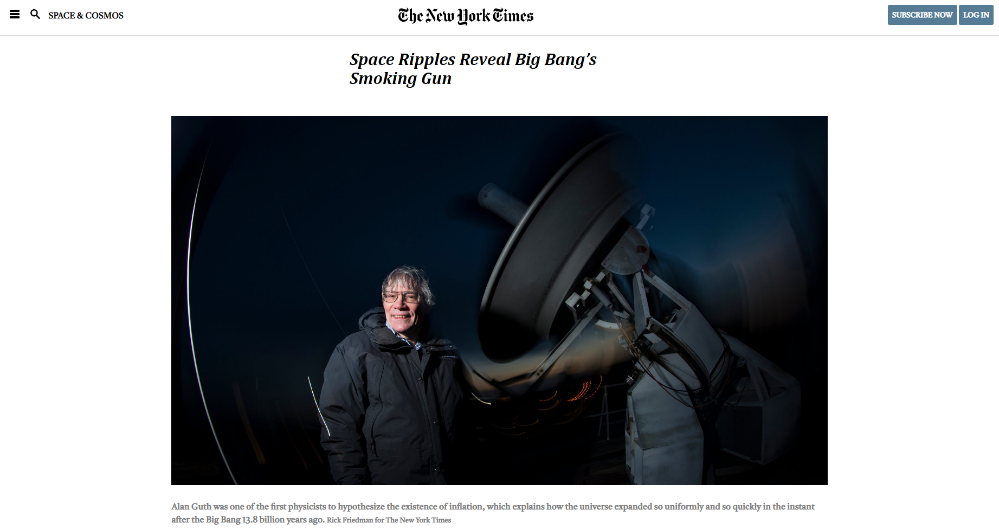

# The New York Time - COPY

> This is the project of our first week on Microverse.

This a copy of an article from The New York Times featuring the nav bar, header, body(img, text video) and a footer.

## Built With

- HTML
- CSS

## Live Demo

[Live Demo Link](https://luisvinicius09.github.io/theNewYorkTimes-copy/.)

## Getting Started

**This is an example of how you may give instructions on setting up your project locally.**
**Modify this file to match your project, remove sections that don't apply. For example: delete the testing section if the currect project doesn't require testing.**

To get a local copy up and running follow these simple example steps.

### Prerequisites

- Text editor
- Browser

### Usage

- Open the html file

## Authors

👤 **Author1**

- GitHub: [@luisvinicius09](https://github.com/luisvinicius09)
- Twitter: [@luisvinicius09](https://twitter.com/luisvinicius09)
- LinkedIn: [LinkedIn](https://linkedin.com/luis-vinicius)

👤 **Author2**

- GitHub: [@icebox827](https://github.com/icebox827)
- Twitter: [@heracles2k5](https://twitter.com/@heracles2k5)
- LinkedIn: [LinkedIn](https://www.linkedin.com/in/denis-lafontant-37031439/)

## 🤝 Contributing

Contributions, issues, and feature requests are welcome!

Feel free to check the [issues page](issues/).

## Show your support

Give a ⭐️ if you like this project!

## Acknowledgments

- Hat tip to anyone whose code was used
- Inspiration
- etc
